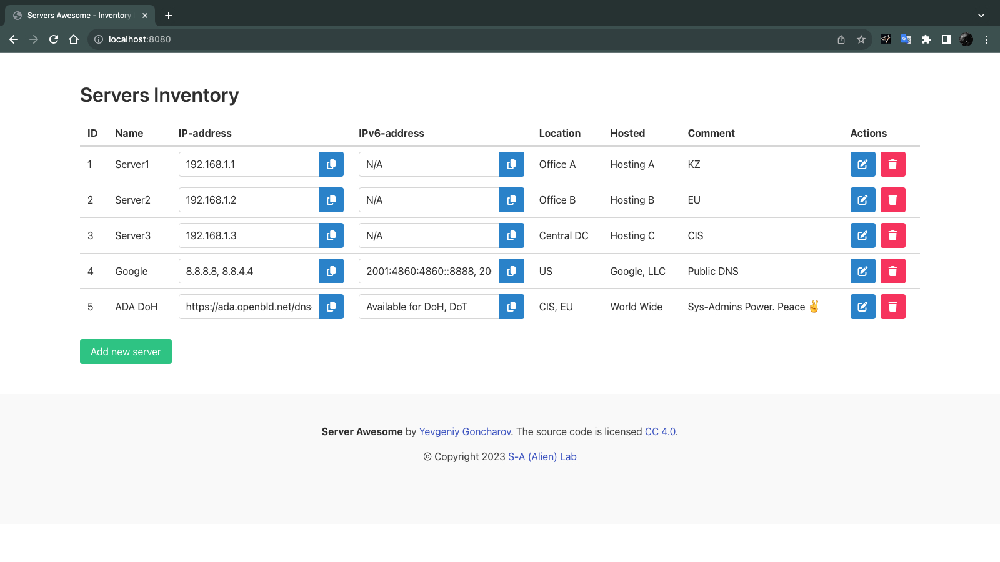

# serversAwesome

Awesome Servers Inventory Web App, which is a simple web app to manage your servers inventory.



## Features
- Add new server
- Edit existing server
- Delete existing server
- Copy server IP details to clipboard
- Export data to CSV file
- Yaml config file
- Portable sqLite database
- One binary file to run the app

## Build and Enjoy

```shell
go build -o serversAwesome -v .
```
Then run:
```shell
./serversAwesome
```
Open your browser and go to: `http://localhost:8080`

Done!